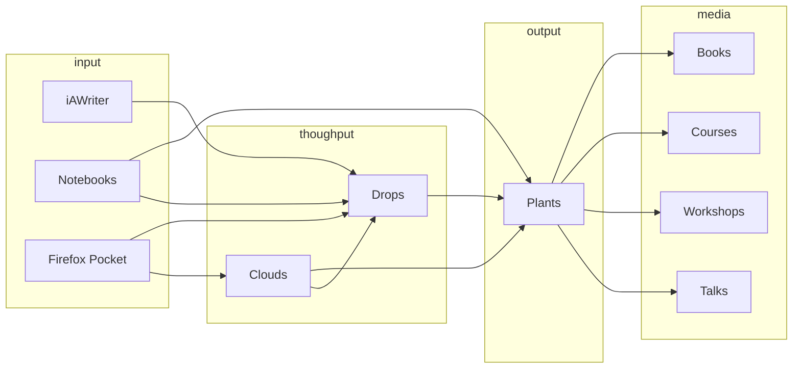

<hr>

## Manual für den Digital Garden 


> Embrace Imperfection!

Die Struktur muss so einfach wie möglich bleiben. Ich speichere alle Markdown Dokumente in einen einzigen Ordner. Auch alle Bildanbindungen liegen in einem Ordner. So stelle ich sicher, dass ich alle meine Inhalte zu einem späteren Zeitpunkt problemlos von Hugo zu einem anderen System portieren kann.

> Tom Critchlow, a consultant who has been cultivating his digital garden for years, spells out the main difference between old-school blogging and digital gardening. “With blogging, you’re talking to a large audience,” he says. “With digital gardening, you’re talking to yourself. You focus on what you want to cultivate over time.”

Der Digital Garden ist im Grunde die digitale Version meiner Notizbücher. Hier werden Ideen weiterentwickelt, die als Notizen begonnen haben. 

Der Digital Garden ist kein Zettelkasten, es nicht um die systematische Entwicklung von texten sondern um die Auseiandersetzung mit den eigenen Gedanken. 

Wie bei der induktiven Gestaltung wachsen die Ideen, oft motivlos. Es gibt keine stregen Regeln. Das Sytem sollte so einfach und offen wie möglich bleiben.

---

## Texte scanbar machen

Mit **bold** und <mark>highlight</mark>

---

## Warum Hugo?

Im Laufe der letzten Jahre habe ich einige verschiedene Systeme ausprobiert, um meine Notizen zu verwalten und zu eigenen Ideen zusammenzuführen. Dabei bin ich in dieselbe Falle getappt wie meine Studierenden und habe ständig die Tools gewechselt. Dabei habe ich ständig an den Strukturen herumgebastelt und musste so immer wieder von Neuem anfangen. Ich war nie zufrieden und habe es auch als Ablenkung genutzt, um nicht an den Dingen zu arbeitenm, die wirklich wichtig sind. 

Dabei habe ich vergessen und ausgeklammert, dass es am Ende um die Prinzipien gehtm, mit denen ein System aufgebaut wird, nicht die Technik. Als ich dann **Tiago Forte's Buch über das zweite Gehirn** angefangen habe, ist mir aufgefallen, dass er gar kein konkretes Tool empfiehlt (so wie ich es bei meinen Studierenden auch nicht tue), sondern einfach nur Methoden anbietet, die mit verschiedenen Tools umgesetzt werden können.

Ich denke, es ist hier wie so oft richtig, auf die eigene **Resonanz** zu hören. Wenn man mit einem Tool resoniert, dann ist das schon die halbe Miete. Ich persönlich resoniere mit dem Lowtech-Ansatz, mit Hugo als universellem Tool und Vim als Ablenkungsfreies Schreibwerkzeug. 

---

## Analogie zu Tiago Fortes PARA-Methode
```
Project  --> Plant
Area     --> Tags
Resource --> Cloud
Archive  --> Ablage
```

- Archive
    - Fertige Projekte
    - Inaktive Themenbereiche
    - Frühere Interessen

