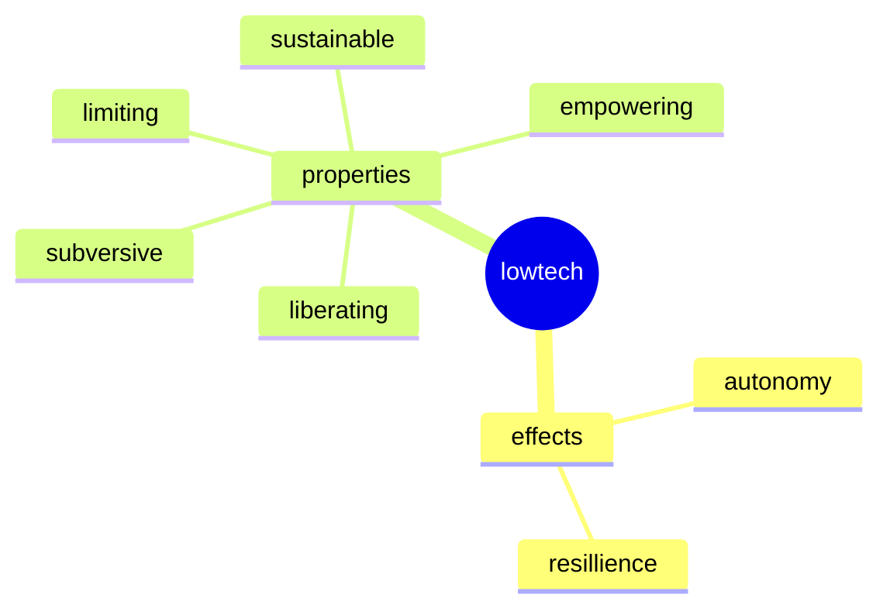

# A short essay about the aesthetics of low tech

Hallo liebe Leute,

ich schreibe euch heute aus Cubelles an der spanischen Küste. Es ist Montag und wie immer bereite ich heute den Post vor, der am Freitag dann automatisch bei euch im E-Mail-Postfach landet. 

Als ich mich in meinem Studium mit der Frage beschäftigte, warum man überhaupt Creative Coding lernen sollte, bin ich auf viele interessante Antworten gestoßen. Einige davon könnt ihr in meiner Masterarbeit entdecken, die ich euch hier verlinke. Weniger über theoretische Recherchen, sondern vielmehr durch einen praktischen Einfall bin ich auf eine faszinierende Idee gekommen.

#### Ein altes MacBook Air

Ich habe ein altes MacBook Air geschenkt bekommen, das softwareseitig keinerlei Updates mehr zuließ und das im Grunde reif für den Müll war. Doch dann kam mir eine Idee: Was wäre, wenn ich dieses wunderschön gestaltete Gerät einfach zu einer Schreibmaschine umzufunktionieren würde? Ich suchte schon lange nach einer Lösung für ablenkungsfreies Schreiben von Texten. Da ich mit einer Social Media Sucht zu kämpfen hatte, fand ich diese Idee äußerst interessant. Ein Freund hatte mir davon berichtet, dass er auf einem alten Computer ein Linux-Betriebssystem installiert hatte, das dem Gerät wieder neues Leben einhauchte. Und so begann ich zu recherchieren, ob das mit dem MacBook Air von 2011 vielleicht auch gehen würde. Und siehe da: Es klappte! 

Nicht dass die Installation von Ubuntu Version 18 ein Spaziergang gewesen wäre: Wer zuvor in der Apple-Welt verwöhnt wurde, stößt hier auf einige Hindernisse. Aber bald hatte ich das Gerät für mich fertig und nahm es auf eine längere Reise mit, um darauf zu schreiben. Ich war überascht als ich merkte, dass ich durch zusätzliche Installationen das Gerät zu einem voll funktionalen Arbeitscomputer upgraden konnte. Zwar waren viele der Programme, die ich normalerweise zum Gestalten nutzte nicht verfügbar, aber genau das machte mich kreativ und ließ mich auf ganz ungewöhnliche Lösungen kommen.

Das Ganze funktionierte immer besser und so wurde die Frage lauter, wieso das eigentlich nicht jeder machte. Würden wir beginnen, unsere Hardware zu reparieren und umzunutzen, uns gegenseitig dabei zu unterstützen, dann könnten wir doch einen gewaltigen positiven Beitrag zum Schutz des Klimas tun. Das Thema hatte mich voll gepackt!

Nach und nach nahm ich den Verzicht auf bestimmte Features, die ich aus der Apple-Welt gewohnt war interessanterweise nicht mehr als Problem wahr, sondern sah sie als Befreiung. Der Convenience-Faktor von Apple-Geräten führt meiner Beobachtung nach nämlich auch zu dem Gefühl, noch mehr schaffen zu müssen. Mit einem upcycled MacBook war ich zwar etwas langsamer, aber ich dachte auch mehr darüber nach, was ich da genau tat.

Bald hatte ich meine gesamte Arbeitsumgebung auf Linux umgestellt und experimentierte mit der Idee, komplett auf Lowtech-Lösungen zu setzen. Bald hatte ich ein Dumbphone und verzichtete für einige Zeit auf mobiles Internet. Ausserdem stieß ich auf immer mehr Netzwerke, die sich kreativ mit dem Thema Lowtech beschäftigten. Damit meine ich nicht nur die Linux- und Open Source Community, sondern auch Menschen wie Kris de Decker, der eine solarbetriebene Webseite betreibt, auf der er über Lowtech-Lösungen  und alternative Energie bloggt. Es gibt ein wunderbares Interview mit ihm beim The great Simplification podcast.

Witzigerweise ist er den selben Weg gegangen wie ich und hat einen uralten Laptop zu seinem Hauptwerkzeug gemacht. 

#### Opportunismus

Als Creator bin ich dann leider irgendwann an die Grenzen des Linux-Ökosystems gestoßen. Ich habe über die Jahre keine Videoschnitt-Software gefunden, die für mich praktisch genug war, um auch unterwegs professionelle Video zu schneiden. Auch in Sachen Bildbearbeitung und Musikproduktion hat mich Linux letztlich so sehr eingeschränkt, dass ich schwach wurde und mir am Ende doch wieder einen Mac kaufte. Zum Programmieren, Schreiben und jeglichen Internet-aktivitäten ist ein Ubuntu Rechner aus meiner Sicht kein bisschen schlechter als ein teures MacBook Pro. Aber wenn es um die Erstellung und Bearbeitung von audiovisuellen Medien geht, kommt man noch an schwer überwindbare Grenzen.

Dennoch habe ich durch diese technische Odyssee jede Menge gelernt. Für mich war sie eine intensive Auseinandersetzung mit der Frage, wie wir als Menschen mit Technologie umgehen. Wir kaufen ständig neues Zeug und belasten damit das Klima, nur weil wir glauben, dass wir immer vorneweg sein müssen, um nicht abgehängt zu werden. Dass es Alternativen gibt, die uns aus diesem Kreislauf ausbrechen lassen, sehen nur Wenige. Diese Alternativen können uns sogar enorm dabei helfen, uns durch diese komplexe Welt zu bewegen. Das bewusste Schaffen von klaren Regeln hilft, als kreative Persönlichkeit einen völlig eigenen, individuellen Stil zu entwickeln.

#### Embracing Limitations

Das Kreativ-Duo Yonk brachte es auf einem Slide in ihrer Präsentation uf dem DEMO-Festival 2022 auf den Punkt, auf dem “Embrace your Limitations” stand. Die Einschränkung wird zum Motor für die individuelle Kreativität. und natürlich beschneiden wir uns damit einigen Möglichkeiten. Aber genau darin liegt ein Geheimnis der Kreativität und sogar der Effektivität: Zu viele Möglichkeiten zwingen uns logischerweise zu vielen kleinen Entscheidungen. Jede Entscheidung kostet Willenskraft und Willenskraft ist der Treibstoff für unsere intrinsische Kreativität. Reduktion von Möglichkeiten mindestens drei große Vorteile:

1. Der Output bekommt einen großen Wiedererkennungswert
2. Die Kreativität wird angekurbelt, da Entscheidungen reduziert werden
3. Die Kreativität wird auf einen bestimmten Punkt fokussiert, so dass ein starker Lerneffekt eintritt

(Diese Liste basiert auf meinen subjektiven Beobachtungen und ist keineswegs vollständig).

## Related Links

- Master
- Ubuntu
- Lowtech magazine
- Lowtech Magazine Laptop
- DEMO Festival 2022
- Yonk
- Lowtech Manifesto

## Lowtech als subversive Ästhetik

Insgesamt trägt die Lowtech-Ästhetik eine starke, subversive Energie in sich. Der Kurator der Ausstellung "Lowtech", die im Jahr 2000 in Zürich und München zu sehen war, schrieb: "Low Tech ist die lässige Antwort auf die Mythen der Technologie und die Bedürfnisse, die eine mit ihr verbundene Industrie wecken will." [^4] Das ist mir wahnsinnig sympatisch und passt für mich perfekt in diese Zeit. 

Im Lowtech Manifesto liest man: “High tech artworks market new PCs. Even if they aren't meant to. Artworks that make use of new, expensive technology can't avoid being, in part, sales demonstrations. Part of the message of an online video stream, whatever its content, is ‘Hey, isn't it time for an upgrade?’. “

## Lowtech-Ästhetik im Grafikdesign

Was bedeutet es, Lowtech im Bereich Grafikdesign zu nutzen? Ich sehe hier vorallem zwei verschiedene Ansätze:

 die Ästhetik vom Tool aus zu denken, sprich bei den Werkzeugen auch konsequent auf High-Tech wie die Adobe Creative Cloud zu verzichten und hier kreative, alternativen Lösungen zu suchen. 

Gehen wir diese Treppe ganz nach unten und denken wir darüber nach, unseren gesamten Workflow als gestalter auf Linux umzustellen, wird es leider sehr schwierig, weil die für verfügbare Designsoftware leider sehr fehleranfällig und auch schwer zu nutzen ist.

## Lowtech in der Lehre

Zumindest war das meine Erfahrung, als ich für Lösungen für meinen Workflow gesucht habe. Videobearbeitung und Grafik- und Layouterstellung sind auf Linux wirklich deutlich weniger komfortabel als auf einem Mac-Computer. Es sind durchaus auch einige technische Skills, bzw. die Bereitschaft vonnöten, sich diese anzueignen. Wenn man sich darauf einlässt, entsteht jedoch eine wunderbare, wirklich authentische und nicht gefakete Lowtech-Ästhetik, die etwas kraftvolles, subversives in sich trägt.

## Outro

Ich freue mich jetzt sehr darauf, nach Barcelona ziehen zu können. Dort gibt es eine spannende und lebendige Lowtech-Szene. Kris de Dekker lebt auch dort und ich hoffe ihn dort zu treffen.

## Glossar

| Begriff                            | Bedeutung |
| ---------------------------------- | --------- |
| Lowtech                          |           |
| Downgrade                          |           |
| Linux                              |           |
| Frugalismus                        |           |
| Frugales Design                    |           |
| vernacular/indigenous technologies |           |
| Digitaler Minimalismus |           |
|                                    |           |
|                                    |           |
|                                    |           |

## Footnotes

[^1]: https://solar.lowtechmagazine.com/de/2020/12/how-and-why-i-stopped-buying-new-laptops/
[^2]: https://www.thegreatsimplification.com/episode/33-kris-de-decker
[^3]: http://lowtech.org/projects/n5m3/
[^4]: https://www.kunstforum.de/artikel/low-tech/
[^5]: https://en.wikipedia.org/wiki/Low_technology