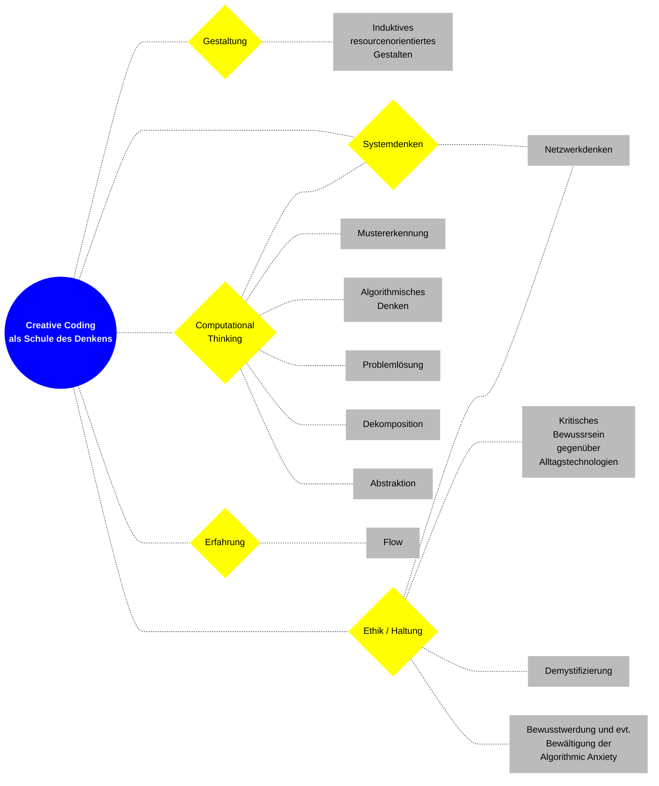

# Philosophie

## Mission Statement

> Our world is changing at a breathtaking pace. New technologies cause fundamental transformations. Now is the time to get creative! To find new ways to deal with change, digitization and disruption. To develop, discover and evaluate new oppor­tunities. Creative Coding provides a common ground for artistic work with algorithms and data in the realms of design. I am building a global community and online-learning platform for Creative Coding, to empower my students to develop a creative and critical stance towards innovation. Together we demystify technology. 
>
> Stand: 30. Juni 2023

---

## Werte

Neugier, Kreativität, Lernen, Integrität, Mut, Skepsis, Klarheit, Aushalten von Offenen Fragen, Offene Ambivalenz

---

## Leitgedanken

#### Akademische Formulierung meiner Motive zur Lehre des Creative Coding

Ich versuche herauszufinden ob und wie kreatives programmieren als Lernprozess und Kultur und künstlerischem Werkzeug zu einem kritischen nachdenken über das individuelle Verhältnis zu Technologie des Alltags verstanden und genutzt werden kann. Dabei sehe ich Creative Coding als Erweiterung, Werkzeug und Gegenstand philosophischer Überlegungen.

---

### Creative Coding als Schule des Denkens

Angebote, die das Programmieren vermitteln gibt es ohne Ende. Mein Ziel ist es, um die Programmierung eine Kultur zu schaffen, die inspiriert und ansteckt. Aus diesem Grund versuche ich, inhärente Aspekte jenseits des Technischen auszuleuchten, sie verständlich darzustellen und mit zeitgemäßen Techniken effektiv in Szene zu setzen. 

### Persönlichkeitsentwicklung als oberstes Prinzip

Ich bin der Meinung, dass die kreative Auseinandersetzung mit Technologien durch Creative Coding zu einer neuen Kultur der kritischen Reflexion unserer zunehmend technologisierten Welt sein kann.

Ich möchte meine Mitglieder und Studierenden zu einem selbstbewussten, kreativen und kritischen Umgang mit komplexen Technologien anregen. Die Stärkung der individuellen Persönlichkeit steht für mich dabei im Vordergrund.

---

### Demystify Technology angewandt auf UX und UI

Das Prinzip “Demystify Technology” konsequent zu leben bedeutet, kompromisslos auf visuelle Klarheit zu setzen. Aufgeräumte, übersichtliche Aufbereitung des komplexen Themas, das ist mein USP, auch im Hinblick auf die chaotischen Platformen wie Youtube.

---

### Demystify Technology: Wordpress as a running System

---

### Lernen statt nur bunte Bilder machen

Es gibt Interessenten, denen die philosophischen Aspekte meiner Arbeit weniger am Herzen liegen und die sich in erster Linie für das Generieren effektiver Bilder zur individuellen Inszenierung in sozialen Medien interessieren. Diese potenziellen Kunden sind für mich uninteressant.

---

### Kultivierung: Digital Humanities

Creative Coding ohne Inhalt bleibt kalt, technisch und leer. Es braucht einen semiotischen Impuls, ein erkenbares Objekt, um Wirkung zu entfachen. Deshalb nutze ich Material aus dem reichhaltigen kulturellen Erbe der Menschheit, das ich in Archiven finde. Dabei ist für mich wichtig, dass diese Materialien in der Public Domain stehen und damit frei verfügbar und nutzbar sind. Diese Regel/Einschränkung gibt meiner Arbeit einen einzigartigen Look and Feel. 

Die Studierenden soll eine Auseinandersetzung mit historischem Material auf eine intellektuelle Reise schicken, die die Kälte des Programmierung mit einer kulturellen Ebene ergänzt. 

### Induktives Gestalten

Design wird im Allgemeinen als Problemlösungsdisziplin wahrgenommen, die einen Input von aussen erfordert. Meist ist dies ein Kunde mit seinem Anliegen. Das Ziel meiner Lehre ist es, den äußeren Input zu eleimienieren und die Studierenden auf eine Suche nach eigenen Ideen schicken. 

Um frei zu denken, müssen wir uns vom Diktat des Auftraggebers befreien. Hierzu ist ein schwieriger Denkvorgang nötig, nämlich nicht vom Problem auszugehen, sondern vom Werkzeug oder Material: Beim explorativen Gestalten geht es um das durchiterieren. 

### Lowtech und Frugalismus

- Anerkennung, Auslotung und Exploration des schon Vorhandenen
- Vereinfachung von Systemen
- Low Dependencies
- Unabhängigkeit
- Simple Systems
- Degrowth
- Einfachheit
- Umwege gehen
  - Eigene Tools bauen
  - 

### Technologien

Die Landschaft der verfügbaren Technologien verändert sich in rasendem Tempo. Als Bildungseinrichtung eine nachhaltige Wahl für einen bestimmten Technologie-Stack zu fällen ist aus mehreren Perspektiven riskant und kontraproduktiv.

Lösung: Immer bei den Basics und niederschwellig bleiben. Es geht um Grundlagenskills und Aktivierung zur späteren individuell-intrinsischen Weiterfahrt meiner Studierenden.

### Prinzipien statt Sprachen lernen

**Ich strebe die Vermittlung von Prinzipien anstatt von technologischen Skills an.** Hierfür eignet sich aus meiner Sicht die Idee von Processing, wie auch Web-Technologien am besten. Processing verfolgt die Idee, eine möglichst einheitliche Syntax für möglichst viele Programmiersprachen und Anwendungsbereiche zu entwickeln. Processing-Derivate gibt es für Java, Javascript, Python, Android und viele weitere Sprachen.

- Onboarding

---

## Basic Vocabulary

---

## Notizen

- Digitale Ermächtigung ganz nach vorne stellen!
  - Was bedeutet D. E. ?
- Demystifizierung von Technologie
- Open Source ist besser als Closed Source
- Lernen von Prinzipien ist wichtiger als Lernen von Technologien
- Lowtech
- DIY
- Diversität
- Klarheit
- Reduziert
- Frugalismus?
- Upcycling
- In die Black-Box schauen
- Technologie als Werkzeug verstehen, niemals als Prestigeobjekt
- Eitelkeiten identifizieren
- Dekoration eliminieren
- Rohe Ästhetik
- Simplicity
- Minimalistisch
- Abhängigkeiten vermeiden!
  - Low Dependency Graph
    - Schöne Analogie zwischen Leben uns Software
    - Ich mag es gerne wenn sich das übeschneidet
    - So wird die Schule des Programmierens zur Schule für’s Leben
- Umweltbewusst
- Fähigkeiten fördern, nicht Wissen
- Low-Fidelity (LoFi)
- Eleganz

---

## Werte und Ziele

trcc hat sich zum Ziel gesetzt, eine diverse und tolerante Community aufzubauen, die Menchen weltweit vernetzt und dabei unterstützt, einen kreativen und künstlerischen Zugang zu Software und digitalen Technologien zu entwickeln und zu fördern. Wir glauben daran, dass die Förderung von STEM-Fähigkeiten bei jungen Kreativen einen großen gesellschaftlichen Beitrag zur Digitalen Mündigkeit leisten kann.

Wir glauben daran, dass wir den kreativen Umgang mit digitalen Technologien neu kultivieren können und müssen, um eine klarere, reflektiertere Perspektive auf unsere digitalisierte Welt zu ermöglichen.

Wir glauben auch daran, dass Digitale Kunst die kritische Reflektion von Innovationen möglich machen kann und dass künstlerische Artefakte aus diesem Genre einen wichtigen Beitrag zur digitalen Bildung und Mündigkeit leisten können.

---

Ich möchte meinen Studierenden und Mitgliedern bestimmte Denkweisen beibringen. Es geht nicht um das Bildermachen, sondern um die Konfrontation und Kultivierung des Codes als Stellvertreter für die Digitalisierung

---

## Kunst oder Design?

- Beides
- Persönlichkeitsentwicklung
- Künstlerisches Grafikdesign
- Beides. Im Deutschen ist der Begrifft “Gestaltung”
- Bezug auf Bruno Munari’s “Design as Art”
- Lernen durch künstlerisch gefärbte Design-Projekt

---

## Know How für Generalisten

- Processing als Schweizer Taschenmesser

---

- Mindset
  - Low Dependencies
    - Möglichst keine Bibliotheken
  - Principles first / Learn the basics
  - Prevent Resignation
  - Low Tech
  - New Aesthetic
  - Creativity first!
    - Bei mir geht es um Kreativität, nicht um Technikskills
  - Die Psychologie hinter dem CC
  - Induktive Gestaltung

![[grafik.png]]

- 

## Anwendungsfälle von AI

- Generieren von Illustrationen und Vorlage
- Transkribieren von Texten
- Übersetzen von Texten

- 

## Leitgedanke: The Creative Technologist

The Cause – Wenn ich als “charsimatic leader” die Community binden will, muss ich ihnen einen gemeinsamen Anlass, eine Sache, einen Ausblick in die Zukunft geben. Der Kunde fragt sich bekanntlich immer: “Was hab ich davon?”. Diese Frage muss ich für meine Kunden beantworten.

Besonders effektiv ist es, wenn ich ihnen ein Rollenvorbild vorlebe und diesem einen Namen gebe, mit dem sie sich identifizieren können. Genau dies ist für mich “The Creative Technologist”.

---

Der _Creative Technologist_ ist ein Ideal: Ein neuartiger Typus von Gestalter:in, der/die in der Schnittmenge zwischen Gestaltung und Technologie arbeitet und explorativ neue Ideen und Prototypen für kreative Anwendungen entwirft.

Wozu ich meine Studierenden und Mitglieder ausbilden möchte. Zwar kann ich das nur im Kleinen leisten, allerdings geht es mir um eine Grundausbildung, die Orientierung schafft und mögliche Wege aufzeigt.

- Arbeitet in der Schnittmenge zwischen Design und Technologie
- kann die Schnittstelle zwischen beiden Polen darstellen
- kann die Kommunikation zwischen beiden Parts erleichtern
- Kann eigene kleine Prototypen entwickeln
- Arbeitet experimentell und explorativ
- sucht neue Ausdrucksmöglichkeiten

Nun werde ich nicht alle Studierenden und Mitglieder dazu bringen können, creative technologists zu werden. Wenn ich aber ein Stück weit dazu beitragen kann, ein wenig in diese Denke zu kommen, dann habe ich einen guten Job gemacht

Warum möchte jemand überhaupt ein Creative Technologist werden?

Es wird so viele verschiedene Gründe geben wie Interessenten.

-

etc.

–> Hierzu habe ich auch einige Notizen —> Why programmieren lernen

Fragenkatalog

Warum gehe ich an den Markt?

Derzeit gibt es einen riesigen Bedarf an Lehrenden für den Bereich Creative Coding, was ich an einer großen Anzahl von Anfragen für Lehraufträge festmache. Dabei fehlt vorallem an niederschwefligen Einstiegsmöglichkeiten für das Thema, was auch mit der fehlenden Kultur rund um die Programmierung zu tun hat.

Als etablierter Experte in der Schnittmenge aus Design, Technologie und Lehre möchte ich die Digitalisierungswelle nutzen, um den großen Bedarf an einem dezentralen, spezialisierten und asynchronen Bildungsangebot inklusive von Content-Platform und Communty für Creative Coding aufzubauen.

**Idealistische Anliegen**

1. Viele Menschen erfüllen nicht alle Voraussetzungen (Zeit, Geld, Ort), um in den Genuss hochwertiger Bildungsangebote zu kommen. Das gilt ganz besonders für kreative Berufe. Darüber hinaus sind teure Ausbildungen inhaltlich längst outdated und völlig inflexibel. Durch den kritischen Blick auf diese Probleme konnte ich eine Vision entwickeln, wie eine digitale Bildungseinrichtung aussehen könnte, die günstiger, transparenter, flexibler und spezialisierter sein kann als jede physische Einrichtung. Ich möchte vielen Menschen ein wertiges Bildungsangebot anbieten, von dem ich selbst überzeugt bin.
2. Orierntierungspunkt für mich ist der Vorkurs am Bauhaus von Johannes Itten, der eine Grundlehre entwickelt hat, die für alle künstlerischen Disziplinen Gültigkeit hatte und vorallem auf die Entwicklung einer starken Gestalterprsönlichkeit abgezielt hat. Hierzu hat er sogar Atem- und Tanzübungen angeboten (was mir etwas zu esoterisch ist :-)
3. Wissenschaft und Wirtschaft sind sich einig darüber, dass Skills im 21. Jahrhundert wichtiger sind als Wissen. Ich sehe Creative Coding in erster Linie als inhaltlichen Rahmen, um im Lernprozess wichtige Fähigkeiten wie Flexibilität, Lernfähigkeit, Kollaboration, Kreativität, Proaktivität und kritisches Denken zu trainieren. Mein Projekt zielt so gesehen erst an zweiter Stelle auf das Erwerben von technischen Skills ab. In erster Linie geht es mir um die Entwicklung einer starken Persönlichkeit.
4. Wissenschaftliche Studien haben erwiesen, dass im kommenden post-digitalen Zeitalter Creative Coding auf vielen Ebenen zu einem reflektierten Umgang mit Alltagstechnologien beitragen können. Ich möchte selbst als Inspirator zum Hinterfragen von Alltagstechnologien wirken.
5. Zu guter Letzt noch ein paar Argumente für Creative Coding aus beruflichen Perspektive: Kreative Programmierer sind derzeit so gefragt wie nie zuvor. Wer in dieser Disziplin Fähigekeiten erwirbt, kann sich auf einen sicheren Job freuen.

Wofür möchte ich als Personenmarke stehen?

Kreativität, Proaktivität, Integrität,. Authentizität, Imperfektion,, Einfachheit, Philosophie, Mut, Vielseitigkeit, Community, Empathie

Mein Anliegen

Zum Umdenken anregen, Menschen neue Perspektiven zeigen, Vorbild sein, Inspirieren, Kreativität feiern, Menschen miteinander vernetzen

Unternehmensauftrag

Was mache ich für wen aus welchem Grund?

Claims: „**Demystify Technology“, „creative coding = unexplored territories"**

Ich entwickle eine Lernplatform für Creative Coding, die wichtige Aspekte einer realen Hochschulausbildung abdeckt, um Menschen durch die Erfahrungen in der Denkschule „Creative Coding“ zu einem mutigen, skeptischen, neugierigen und vorallem kreativen Umgang mit Code anzuregen.

Mikroumwelt

Wer sind meine aktuellen Kunden? (Gerne allgemeine Beschreibung ihrer Werte, Interessen; Welche besonderen Eigenschaften haben die Menschen, die das Angebot bereits wahrnehmen? Woran glauben sie? Was treibt sie an? Wovor haben Sie Angst? Warum wollen sie Creative Coding lernen? Auf welchem Weg kommen sie zu dir?; wenn vorhanden auch Personae)

- Kommen meist über Instagram (glaube ich)
- Wollen sich Digitalkompetenz antrainieren
- Suchen Verbindung / Community
- Männer und Frauen (mehr Männer)
- Sehr vielseitig
  -

Wer sind meine Wettbewerber?

- SuperHi (sehr teuer, aber super platform)
- Elektronnaut (keine Vision)
- Udemy (zu billig)
- Keiner der Wettbewerber hat ein starkes philosophisches Profil!

Wer sind Lieferanten/Partner/Produzenten/Zulieferer? (sofern ich welche habe)

- Ich arbeite mit ein paar Studierenden
- Ansonsten bin ich an einige Services gebunden (Hosting zum Beispiel)

Makroumwelt

Welche technologischen Entwicklungen beeinflussen mein Geschäft bzw. könnten Einfluss auf mein Business und meine Kunden haben? (Bsp.: Weiterentwicklung Processing, neue Technologien, etc.)

- Stop der Entwicklung an Processing

- Patreon funktioniert nicht mehr so wie es soll

- Megatrnds (Studierende werden nach Kursen zu den Themen fragen)

- - Blockchain
  - KI
  - NFTs
  - DAO
  - VR / AR

Welche politischen Entwicklungen beeinflussen mein Geschäft bzw. könnten Einfluss auf mein Business und meine Kunden haben? (Bsp.: neue Gesetze, DSGVO, Steueränderungen, etc.)

- Zum Glück nur sehr wenige
- Internetzugang muss funktionieren

Welche soziokulturellen Entwicklungen beeinflussen mein Geschäft bzw. könnten Einfluss auf mein Business und meine Kunden haben? (Bsp.: Wertewandel, Diversitätsdebatte, neue Lebens- oder Arbeitsstile, etc.)

- Diversität: Ich möchte gerne mehr Menschen aus anderen Kulturen dabei haben
- Mehr Geschlechterdiversität, aber nicht erzwungen, wie es derzeit im Kino zu beobachten ist :-D

\-

Welche makroökonomischen Entwicklungen beeinflussen mein Geschäft bzw. könnten Einfluss auf mein Business und meine Kunden haben? (Bsp.: Wirtschaftswachstum, Inflation, Arbeitslosenquote, etc.)

\- Grundsätzlich bin ich hier relativ stabil aufgestellt (so weit ich das einschätzen kann)

\-

Kunden

Wer könnten meine potenziellen Kunden sein? Und warum?

- Fast alle Menschen mit einem Interesse in der Schnittmenge Kunst/Design/Technologie/Community könnten meine Kunden sein
- Ich will aber auch Menschen ausserhalb dieser Bubble erreichen. Schließlich geht es bei mir nicht um Technik-Skills, sondern um Life-Skills für das 21. Jahrhundert!

> Our job as expert and leader is to help bring people to higher ground. To move them from where they are to where they want to be.

> […] For you to have succes in this business, you have to give your followers hope of something better so they will be perceptive to the change you are going to offer them.

> […] It’s your job to create that vision.

> …all mass movements are build on hope.

> …these winnners presented a new opportunity where the losers were offering improvement

---

## Vision

Ich bin davon überzeugt, dass eine skeptische, neugierige und kreative Haltung zu digitalen Technologien ein Schlüssel zu mehr Unabhängigkeit und einem freieren und intelligenteren Nachdenken über unsere digitale Welt führt.

Diese Erfahrung hat mein eigenes Leben fundamental verbessert und ich möchte Anderen diese Erfahrung zugänglich machen.

Das kreative Denken in Code und Systemen kann zu einem grundsätzlichen Hinterfragen unserer Arbeit und der Schlüssel zu ganz neuen, nie dagewesenen Ideen führen. Diese können sowohl künstlerischer, gestalterischer oder sogar unternehmerischer Natur sein.

Leider ist es ohne Hilfe und Vernetzung sehr schwer, einen Zugang in diese Welt zu finden. Wer diesen gigantischen Raum aufschließt, steht vor einer unendlichen Menge von Informationen. Genau hier schaffe ich Orientierung und zeige einen zielgruppenspezifischen Weg durch diese erste Orientierungslosigkeit.

Wer es schafft, den Code und das Programmieren für sich vom verteufelten Schulfach hin zum kreativen Material und Werkzeug umzukultivieren, der erfährt eine schwer vorstellbare der Selbstermächtigung. Hierfür ist oft nicht weniger als ein individueller Paradigmenwechsel notwendig. Der Prozess ist schwierig. Genau für diese Erfahrung baue ich die richtige Umgebung.

Ich entwickle eine Online-Community für Gestaltern aus ganz Europa, die vernetzt gemeinsam durch das Erlernen des Creative Coding die schwer zugänglichen Räume der Technologie aufzuschließen und dort die Erfahrung der Digitalen Ermächtigung zu machen.

# Wortmarke

## tim rodenbröker creative coding

- klare verbindung des Themas mit meiner Person

#### 

- Zeitlos wie Reclam werden
- Gegenentwurf zur schnellen und kurzlebigen Youtube-Welt
- Fundament

## Technologische Basis

> Sokrates: “Wie zahlreich sind doch die Dinge, denen ich nicht bedarf.”

> According to Schneider (1978, 110), choosing a programming language suitable for use in education “should be based on two critical and apparently opposing criteria: richness and simplicity – rich in those constructs needed for introducing fundamental concepts in computer programming (yet) simple enough to be presented and grasped in a one semester course.” Interpreting Schneider’s view using the notion of “low threshold, high ceiling, and wide walls” (M. Resnick et al. 2005), it can be argued that effective tools (programming languages) must make it easy for novices to get started (low threshold), make it possible for experts to make sophisticated projects (high ceiling), and support and suggest a wide range of explorations (wide walls). One tool that fits within this description and is frequently mentioned in both graphic design and computer science literature is Processing (Fry, Reas, & Maeda 2007), a Java-based textual programming language popular among artists, designers, and architects and used widely throughout professional industries and education.

- Processing
  - low threshold
  - high ceiling
  - and wide walls
- Web-Technologies
  - higher threshhold
  - no ceiling
  - no walls

ProcessingWeb Fundamentals
HTML/CSS/JSp5jsNet ArtCreate your
PortfolioEinstiegData Visualization

---

## Community

> Eine Gemeinschaft kann als Online-Versammlung beginnen, aber um zu gedeihen wird sie auch in  der Offline-Welt Wurzeln schlagen müssen.
>
> *Yuval Noah Harari*

---

## Related Links
