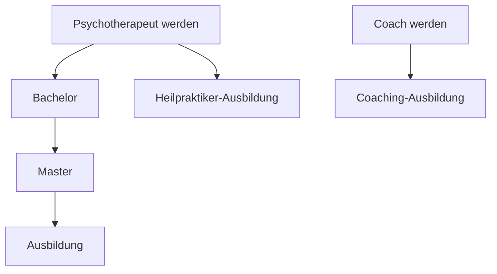

## Coach oder Therapeut werden

Heute habe ich etwas ausgesprochen das schon tiel in mir schlummert. Wie so oft passiert das hier bei Lydia und Peter. Ich würde wirklich gerne eine Ausbildung zum Psychotherapeuten machen. Das ist ein Beruf der mich schon immer fasziniert. 

Ich finde Gestaltungs- und Kunsttherapie total interessant, aber auch Verhaltenstherapie. 

---

---

## Argumente

- Angesichts der vielen Krisen und Probleme, mit denen wir heute konfrontiert sind wird es in Zukunft deutlich mehr Menschen geben, die Hilfe bei Psychotherapie suchen.

---

## Ausbildung zum Heilpraktiker in Psychotherapie
- Fernstudium: https://www.ils.de/fernkurse/psychotherapie/
- https://www.paracelsus.de/ausbildung/psy_berat/fr_psy1.asp#toggle-id-1

---

## Ausbildung Heilpraktiker Kunsttherapie
- Kann auch Teil des Psychotherapie-Ausbildung sein

---

## Master Kunsttherapie
- https://www.metafora-art-therapy.org/masters-degree-in-art-therapy/#tab-id-1
- https://www.healthcarestudies.com/institutions/instituto-superior-de-estudios-psicol%C3%B3gicos-isep/master-in-art-therapy

---

## Therapieformen

- Psychoanalyse
- Tiefenpsychologisch fundierte Psychotherapie
- Verhaltenstherapie
- Systemische Thearpie

---

## Kunsttherapie

- Innere Bilder
	- Frida Kahlo
- Art Brut
- Surrealismus
	- Betonung des Unbewussten
- Carl Gustav Jung
- Joseph Beuys 
	- "Kunst ist eine Thearpie"
	- "Jeder ist ein Künstler"

---

## Kunsttherapeutische Triade

---

## Related Links

- https://www.therapie.de/
- Florence
